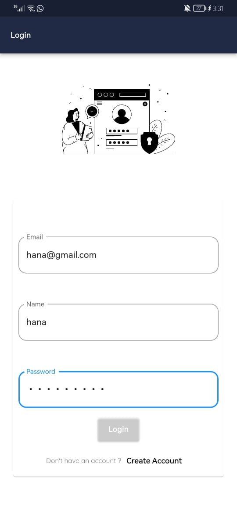

# 💫 CircleUp - Flutter app

This is a social media app that allows users to post, comment, like, and explore a timeline of posts.

## Features

- **Authentication**: Users can sign up, log in, and log out using Firebase authentication.

- **Timeline**: Users can explore a timeline of posts from different users.

- **Posting**: Users can create new posts with content and images.

- **Commenting**: Users can add comments to posts.

- **Liking**: Users can like posts, and the like count is displayed.

## Technologies Used

- **Firebase Authentication**: Used for user registration and login.

- **Firestore**: Used to store and retrieve user data, posts, and comments.

- **Shared Preferences**: Used to store and retrieve local data, such as user preferences.

- **Provider**: Used for state management to handle user authentication and app-wide data.

- ## 📸 Screenshots

Click to expand

### Login Screen

### signup Screen

### Timeline

### Timeline 

### Add new Post

